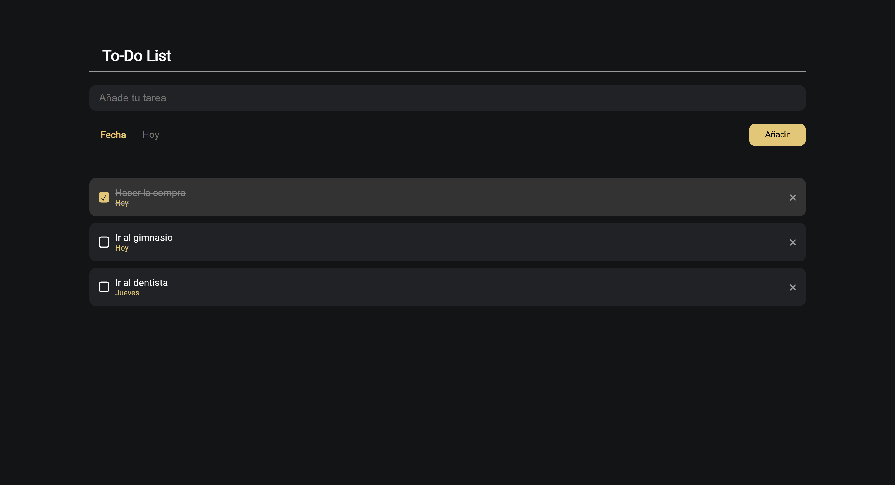

# To-Do List 📝

Una aplicación de lista de tareas interactiva donde los usuarios pueden añadir, marcar como completadas y eliminar tareas. También permite especificar un día para cada tarea. Si no se especifica un día, el valor predeterminado es "Hoy".

## Características
- Añadir tareas con un texto y una fecha personalizada.
- Marcar tareas como completadas.
- Eliminar tareas.
- Guardado local en el navegador para preservar las tareas entre sesiones.

## Captura de pantalla

## Prueba la aplicación
Puedes interactuar con la aplicación en línea a través de este enlace de GitHub Pages: [To-Do List](https://minyanaa.github.io/To-Do-List/)

## Tecnologías utilizadas
- HTML
- CSS
- JavaScript
- GitHub Pages
